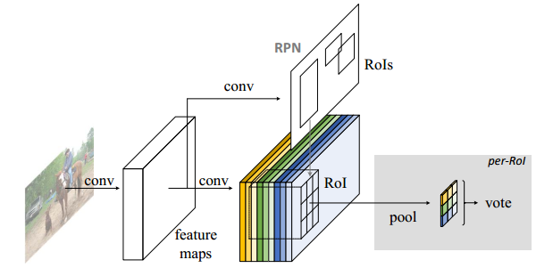
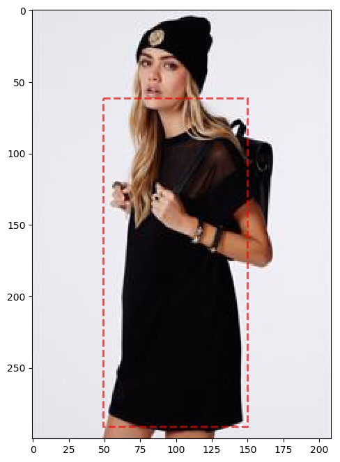
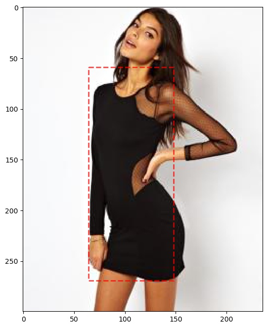

# Keras-RFCN
RFCN implement based on Keras&amp;Tensorflow

This is an implementation of [Region-based Fully Convolutional Networks](https://arxiv.org/pdf/1605.06409v2.pdf) on Python 3, Keras, and TensorFlow. The model generates bounding boxes for each instance of an object in the image. It's based on Feature Pyramid Network (FPN) and a [ResNet50](https://arxiv.org/abs/1512.03385) or ResNet101 backbone.

The repository includes:

* Source code of RFCN built on FPN and ResNet50/101.
* Training code for [DeepFashion Dataset](http://mmlab.ie.cuhk.edu.hk/projects/DeepFashion.html) with 46 clothes classes.
* Pre-trained weights for [DeepFashion Dataset](http://mmlab.ie.cuhk.edu.hk/projects/DeepFashion.html) - See release
* Example of training on your own dataset&nbsp;-&nbsp;see Fashion_Train.py and Fashion_Test.py

# Introduction

Thanks to the [Mask-RCNN implement by matterport](https://github.com/matterport/Mask_RCNN), we have the great framework so that we don't have the needs to generate bounding box and implement the Non-Maximum-Suppression algorithm.

If you are already fimilar with matterport's framework, this repository is easy to understand and use. What I have done is remove the mask head in the framework, which makes it be a Faster-RCNN, and implement a position sensitive ROI pooling layer and a VOTE layer. For more details, please read the [paper](https://arxiv.org/pdf/1605.06409v2.pdf).

# Getting Started

## Train on your own dataset

As you can see in **Fashion_Train.py**, for a specific dataset, all you need is listed below:

* A **XXConfig** class inherit from the **Config** base class in the framework.
* A **XXDataset** class inherit from the **Utils.Dataset**.
* Implement **load_image(image_id)** which returns a numpy array I with I.shape == (Img_h, Img_w, 3) for the specific image id. You don't have the needs to resize image, or take data augment. The framework will do all of them automatically. Just keep the data what it is.
* Implement **load_bbox(image_id)** which returns a tuple with 2 numpy array for the specific image id, the first one is boundbox coordinates (y1,x1,y2,x2), and class ID for the boundbox in order.
* Define your training schedule.

## Predict on your own dataset

See **Fashion_Test.py** as a demo.
More details in writing.

# Framework

This RFCN framework consists of FIVE parts:

* Config.py - the base class of config for a specific dataset.
* Data_generator.py - generate data for a object detection model, like background box, and true box. The images are resized in this script.
* Losses.py - define the l1_smooth loss for box regression and cross-entropy loss for box classification.
* Utils.py - all the auxiliary functions, like compute_iou, non-maximum-suppression, etc.
* BaseModel.py - the base class of our keras model, contains the auxiliary functions for the model, like load weights, save checkpoints, decode the training schedule.
* **Model.py** - the CORE script of our framework, contains the RPN, ScoreMap, position sensitive ROI pooling layer, etc.
* ResNet.py - The resnet backbone, you can choose resnet50 or resnet101.
* ResNet_dilated.py - Take the stages 4+ have a dilate ratio = 2, named DetNet, which is the latest research results in this [paper](https://arxiv.org/abs/1804.06215).

# Experiment Result

To make sure the framework work normally, we have trained the model 240 epochs with DeepFashion dataset. And the detection result might useful:

<figure class="half">
	
	
</figure>

# TODO

* ~~Complete the load_weights function of model.(Done)~~
* Add the callback for eval mAP after each batch end
* Train on MSCOCO